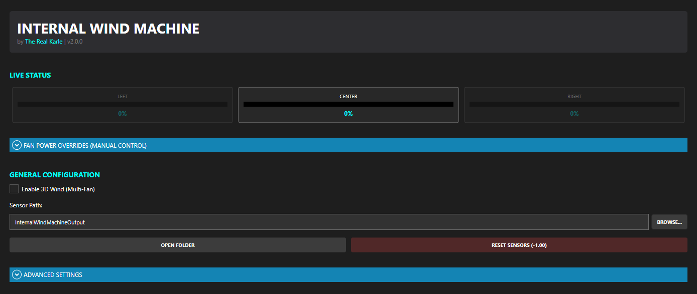
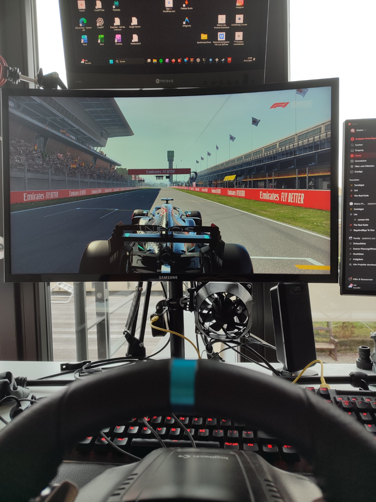

# 🏁 Internal Wind Machine

A professional, software-only wind simulation solution for SimRacing.  
Control standard PC fans connected directly to your motherboard fan headers using live telemetry data — **no Arduino or extra hardware required!**

---

**[📥 Download the Latest Release](https://github.com/therealkarle/InternalWindMachine/releases/latest)**

## 🚀 Choose Your Version

We offer two ways to run the Internal Wind Machine. Choose the one that fits your setup:

### 1. [SimHub Plugin (Recommended)](./SimHub-Plugin)
**The modern way.** Integrated directly into SimHub as a native plugin.
- ✅ **Easy Setup**: No extra scripts or server plugins needed.
- ✅ **Live UI**: Monitor and control your fans directly in SimHub.
- ✅ **Overrides**: Manual power control for each fan individually.
- ✅ **Professional**: Custom icon, sidebar integration, and auto-reset features.

### 2. [Standalone Python Version](./Standalone-Python)
**The flexible way.** A lightweight Python script for users who prefer a standalone solution.
- ✅ **Lightweight**: Pure Python, no DLL installation required.
- ✅ **Customizable**: Open source and easy to modify for advanced users.
- ✅ **Alternative**: Great if you use other telemetry tools or specific custom setups.

---

## � Preview

**[▶️ Watch the Wind Machine in Action (Video)](./Media/WindMachineInUseVideo.mp4)**

---

## �🛠️ Requirements & Setup
Both versions require [**Fan Control**](https://getfancontrol.com/) to communicate with your motherboard's fan headers. Detailed instructions for each version can be found in their respective folders.

---

## 📢 Stay Connected

- [**Linktree (All Links)**](https://linktr.ee/therealkarle)
- [Youtube](https://www.youtube.com/@therealkarle)
- [Twitch](https://www.twitch.tv/therealkarle)
- [TikTok](https://www.tiktok.com/@therealkarle)

---

## 📜 License & Safety
Use at your own risk. This project is for personal use. Ensure your fans are compatible with your motherboard headers (check Ampere/Watt limits!).
