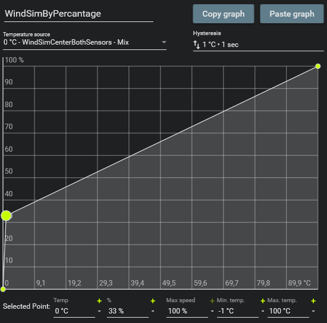

# Internal Wind Machine — SimHub Plugin

A SimHub plugin for a SimRacing wind simulator.  
It allows standard PC fans (connected directly to a motherboard fan header) to be controlled via live telemetry data from racing simulations — **without any external microcontrollers** (e.g., Arduino).

The system is integrated directly into SimHub and interfaces with **Fan Control**.

[SimHub Plugin UI](./Media/SimHubPluginUi.png)

---

## 🌟 Features

- **Native SimHub Integration**: Seamlessly integrated into SimHub.
- **No Extra Software**: Replaces the standalone Python script and the Property Server plugin.
- **Live Status Monitor**: Real-time visual feedback of all fan outputs directly in the SimHub UI.
- **Auto-Update Check**: Automatically notifies you in the UI when a new plugin version is available.
- **Dynamic 3D Wind Support**: Individual control for Left, Center, and Right channels.
- **Individual Fan Overrides**: Manually control each fan with a slider while keeping others on telemetry
- **Expert Mode**: Full control over SimHub property bindings (for advanced users).
- **Safe & Robust**: Automatic sensor reset to -1.00 on exit and double-confirmation for global resets.

---

Check out my [Twitch](https://www.twitch.tv/therealkarle), I plan on streaming a bit with the Wind sim, so it's a good chance to see it in action and ask me questions about it.

---

## 🛠️ Dependencies

The following software must be installed:

- [**SimHub**](https://www.simhubdash.com/) (Plugin based on .NET 4.8)
- [**Fan Control**](https://getfancontrol.com/)

---

## 🚀 Installation

1. Close **SimHub**.
2. Copy the `InternalWindMachinePlugin.dll` into your SimHub plugins directory (usually `C:\Program Files (x86)\SimHub`, you can right click your desktop Icon and select "Open File Location").
3. Start **SimHub**.
4. Enable the plugin in the SimHub settings if it's not already active.
5. You will see a new entry **"Internal Wind Machine"** in the sidebar.

---

## ⚙️ Configuration (UI)

Unlike the standalone version, everything is configured via the SimHub interface:
- **General**: Enable 3D Wind and set your output folder path.
- **Fan Power Overrides**: Manually test your fans or set a fixed wind speed for specific channels.
- **Advanced**: Toggle individual fans and manage expert property bindings.

---

## 💨 Fan Control Setup

1. Open **Fan Control**.
2. Create a **Custom Sensor** (File).
3. Point to the sensor file(s) in the `InternalWindMachineOutput` directory:
   - `InternalWindMachineOutput\WindPercentageCenter(default).sensor`
   - `InternalWindMachineOutput\WindPercentageLeft.sensor` (if 3D enabled)
   - `InternalWindMachineOutput\WindPercentageRight.sensor` (if 3D enabled)
4. Create a **new control curve** for each fan you want to use:
   - **Minimum temperature**: `-1`
   - **Maximum temperature**: `100`
   - **Recommended curve**: A linear line from `0 °C → (The Lowest % at which the Fan stops spinning, e.g., 33%)` to `100 °C → 100%`.
   - **Important**: Add a point at **-1 °C → 0%** to ensure the fan powers down when you close SimHub.

5. Assign the fan(s) to the corresponding control curve(s).

---

## 🔧 Troubleshooting

- **No fan response**: Ensure the path in the Plugin matches the path in **Fan Control**.
- **Plugin not showing**: Verify that the `.dll` is in the correct folder and you are running a recent version of SimHub.
- **Live Status works, but no wind in-game**: Make sure telemetry is correctly configured for your specific game in SimHub.

---

## 📦 Notes & 3D Prints

The control latency is extremely low. For the best result, I recommend using a nozzle for your fan.
[**Here is the 3D-printable nozzle I use**](https://www.thingiverse.com/thing:6845650).

---

## 📜 License

Use at your own risk. This project is intended for personal and experimental use. For commercial use or embedding this into a commercial project, please contact me.

---

## 📢 Shameless Self Promotion

Stay connected and see the Wind Machine in action:

- [**Linktree (All Links)**](https://linktr.ee/therealkarle)
- [Youtube](https://www.youtube.com/@therealkarle)
- [Twitch](https://www.twitch.tv/therealkarle)
- [TikTok](https://www.tiktok.com/@therealkarle)
- [Instagram](https://www.instagram.com/therealkarle)
